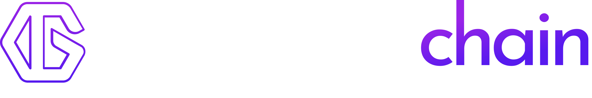
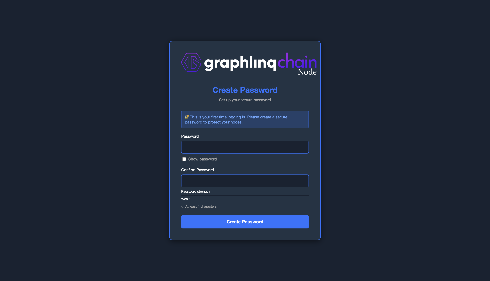

<h1 align="center">Graphlinq - CLI</h1>

<p align="center">
  
  <br>
  <i>Graphlinq CLI is a command line for building Nodes
  <br>
</p>

<p align="center">
<a href="https://npmjs.org/package/@graphlinq/graphlinq-cli">

</a>&nbsp;
<a href="https://tldrlegal.com/license/mit-license">
</a>
</p>

## Installation

````shell
npm install -g @graphlinq/graphlinq-cli
````

## Usage

````shell
graphlinq [command] [options]
graphlinq --help
````

````shell
graphlinq install
````

#### `[command]`

- `graphlinq install` - install NodeManager
- `graphlinq start` - start NodeManager
- `graphlinq stop` - stop NodeManager
- `graphlinq reset` - reset NodeManager
- `graphlinq update` - install, stop, restart if new version was downloaded

#### `--help|-h`

Show help

### Examples

#### `graphlinq install`

Use for create sample application :

````shell
$ graphlinq install
✔ Successfully installed NodeManager.
````

#### `graphlinq start`

Use for start NodeManager :

````shell
$ graphlinq start
✔ NodeManager started successfully you can access it at http://0.0.0.0:8080
````

Go to http://localhost:8080



#### `graphlinq stop`

Use for stop NodeManager :

````shell
$ graphlinq stop
✔ NodeManager stopped successfully
````

#### `graphlinq update`

Use for update NodeManager :

````shell
$ graphlinq update
✔ Installation Successfully finished.
✔ NodeManager stopped successfully
✔ NodeManager started successfully
✔ Update Successfully finished.
````

#### `graphlinq reset`

Use for reset NodeManager :

````shell
$ graphlinq reset
✔ NodeManager reset successfully
````

## License
